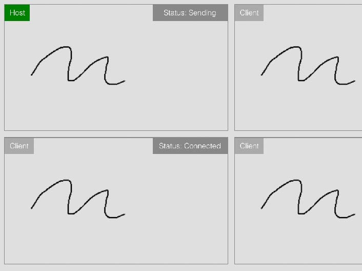

# Portfolio examples built with React, Typescript, Chakra UI

## Weather API Demo

Hourly forecast data loaded from NOAA with Recharts and Chakra UI components

 

## Gallery Astronomy Picture of The Day

API fetching with a custom gallery and navigation using Chakra UI

 

## WebRTC Example

Real-time drawing between WebRTC clients

 

## AR Tensorflow

3d Model created in blender, mapped to Face Landmarks detected using Tensorflow

 

---

## To Run/Install this repository

 

### `yarn install`

Installs the app

### `yarn start`

Runs the app

### `yarn test`

Launches the test runner

### `yarn build`

Builds the app
